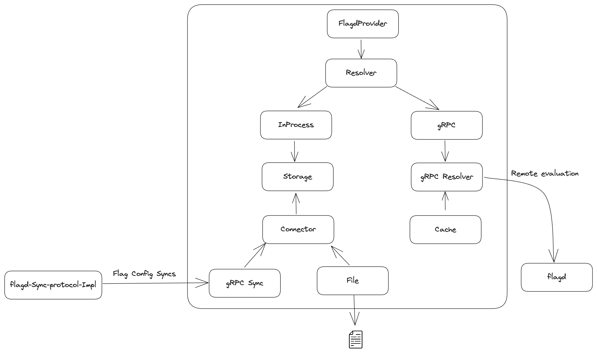

# flagd Provider for OpenFeature

Given below is the architecture of the provider implementation.



## Building

`mvn compile` will pull the `schemas` and `sync` submodule, and build the gRPC resources.
Note that in some editors, you will need to disable some automatic compilation options to prevent your editor from cleaning them.
In vscode for instance, the following settings are recommended:

```json
{
  "java.configuration.updateBuildConfiguration": "automatic",
  "java.autobuild.enabled": false,
  "java.compile.nullAnalysis.mode": "automatic"
}
```

## End-to-End Tests

The continuous integration runs a set of [gherkin e2e tests](https://github.com/open-feature/test-harness/blob/main/features/evaluation.feature) using [`flagd`](https://github.com/open-feature/flagd). These tests do not run with the default maven profile. If you'd like to run them locally, you can start the flagd testbed with

```
docker run -p 8013:8013 ghcr.io/open-feature/flagd-testbed:latest
```
and then run 
```
mvn test -P e2e
```