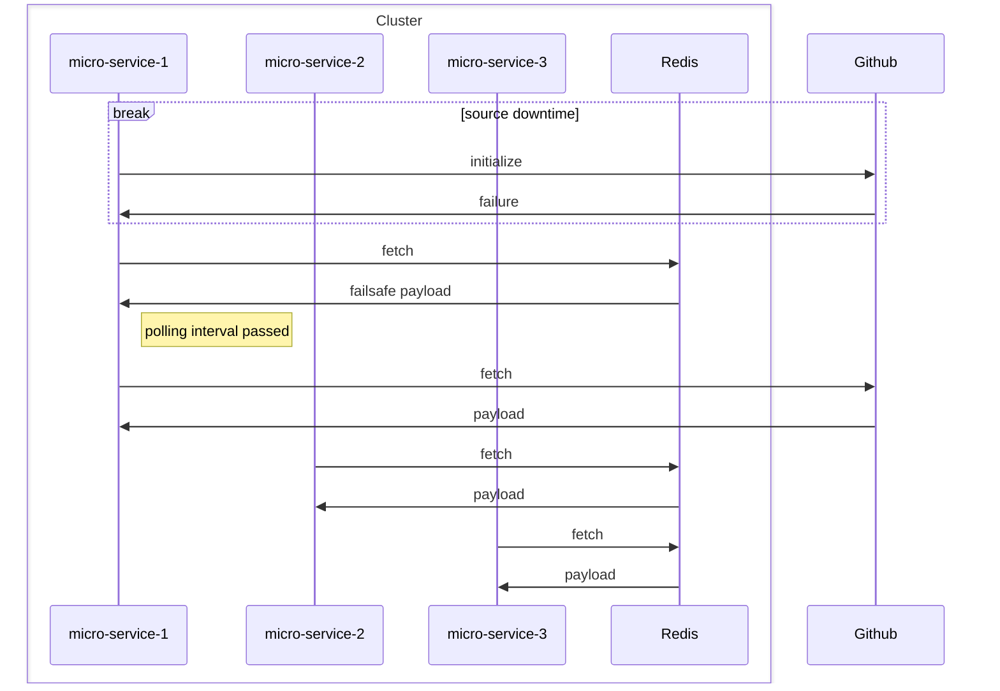

# Http Connector

## Introduction
Http Connector is a tool for [flagd](https://github.com/open-feature/flagd) in-process resolver.

This mode performs flag evaluations locally (in-process). 
Flag configurations for evaluation are obtained via Http.

## Http Connector functionality

HttpConnector is responsible for polling data from a specified URL at regular intervals.  
It is leveraging Http cache mechanism with 'ETag' header, then when receiving 304 Not Modified response,
reducing traffic, reducing rate limits effects and changes updates. Can be enabled via useHttpCache option.  
The implementation is using Java HttpClient.

## Use cases and benefits
* Reduce infrastructure/devops work, without additional containers needed.
* Reduce latency, since the data is fetched in-process.
* Reduce external network traffic from the Http source even without a flagd separate container / proxy when 
  polling cache is used.
* Use as an additional provider for fallback / internal backup service via multi-provider.

### What happens if the Http source is down when application is starting ?

It supports optional fail-safe initialization via cache, such that on initial fetch error following by
source downtime window, initial payload  is taken from cache to avoid starting with default values until
the source is back up. Therefore, the cache ttl expected to be higher than the expected source
down-time to recover from during initialization.

### Polling cache
The polling cache is used to store the payload fetched from the URL.  
Used when usePollingCache is configured as true.
A key advantage of this cache is that it enables a single microservice within a cluster to handle the polling of a 
URL, effectively acting as a flagd/proxy while all other services leverage the shared cache. 
This approach optimizes resource usage by preventing redundant polling across services.

### Sample flow
Sample flow can use:
- Github as the flags payload source.
- Redis cache as a fail-safe initialization cache and as a polling cache.

Sample flow of initialization during Github down-time window, showing that application can still use flags
values as fetched from cache.


## Usage

### Installation
<!-- x-release-please-start-version -->
```xml
<dependency>
  <groupId>dev.openfeature.contrib.tools</groupId>
  <artifactId>flagd-http-connector</artifactId>
  <version>0.0.1</version>
</dependency>
```
<!-- x-release-please-end-version -->

### Usage example

```java

HttpConnectorOptions httpConnectorOptions = HttpConnectorOptions.builder()
    .url("http://example.com/flags")
    .build();
HttpConnector connector = HttpConnector.builder()
    .httpConnectorOptions(httpConnectorOptions)
    .build();

FlagdOptions options =
    FlagdOptions.builder()
        .resolverType(Config.Resolver.IN_PROCESS)
        .customConnector(connector)
        .build();

FlagdProvider flagdProvider = new FlagdProvider(options);
```

### Configuration
The Http Connector can be configured using the following properties in the `HttpConnectorOptions` class.:

| Property Name                             | Type                | Description                                                                                                                                                                                                                                                                                                                                                                         |
|-------------------------------------------|---------------------|-------------------------------------------------------------------------------------------------------------------------------------------------------------------------------------------------------------------------------------------------------------------------------------------------------------------------------------------------------------------------------------|
| url                                       | String              | The URL to poll for updates. This is a required field.                                                                                                                                                                                                                                                                                                                              |
| pollIntervalSeconds                       | Integer             | The interval in seconds at which the connector will poll the URL for updates. Default is 60 seconds.                                                                                                                                                                                                                                                                                |
| connectTimeoutSeconds                     | Integer             | The timeout in seconds for establishing a connection to the URL. Default is 10 seconds.                                                                                                                                                                                                                                                                                             |
| requestTimeoutSeconds                     | Integer             | The timeout in seconds for the request to complete. Default is 10 seconds.                                                                                                                                                                                                                                                                                                          |
| linkedBlockingQueueCapacity               | Integer             | The capacity of the linked blocking queue used for processing requests. Default is 100.                                                                                                                                                                                                                                                                                             |
| scheduledThreadPoolSize                   | Integer             | The size of the scheduled thread pool used for processing requests. Default is 2.                                                                                                                                                                                                                                                                                                   |
| headers                                   | Map<String, String> | A map of headers to be included in the request. Default is an empty map.                                                                                                                                                                                                                                                                                                            |
| httpClientExecutor                        | ExecutorService     | The executor service used for making HTTP requests. Default is a fixed thread pool with 1 thread.                                                                                                                                                                                                                                                                                   |
| proxyHost                                 | String              | The host of the proxy server to use for requests. Default is null.                                                                                                                                                                                                                                                                                                                  |
| proxyPort                                 | Integer             | The port of the proxy server to use for requests. Default is null.                                                                                                                                                                                                                                                                                                                  |
| payloadCacheOptions                       | PayloadCacheOptions | Options for configuring the payload cache. Default is null.                                                                                                                                                                                                                                                                                                                         |
| payloadCache                              | PayloadCache        | The payload cache to use for caching responses. Default is null.                                                                                                                                                                                                                                                                                                                    |
| useHttpCache                              | Boolean             | Whether to use HTTP caching for the requests. Default is false.                                                                                                                                                                                                                                                                                                                     |
| useFailsafeCache                          | Boolean             | Whether to use a failsafe cache for initialization. Default is false.                                                                                                                                                                                                                                                                                                               |
| usePollingCache                           | Boolean             | Whether to use a polling cache for initialization. Default is false.                                                                                                                                                                                                                                                                                                                |
| PayloadCacheOptions.updateIntervalSeconds | Integer             | The interval, in seconds, at which the cache is updated. By default, this is set to 30 minutes. The goal is to avoid overloading fallback cache writes, since the cache serves only as a fallback mechanism. Typically, this value can be tuned to be shorter than the cache's TTL, balancing the need to minimize unnecessary updates while still handling edge cases effectively. |
