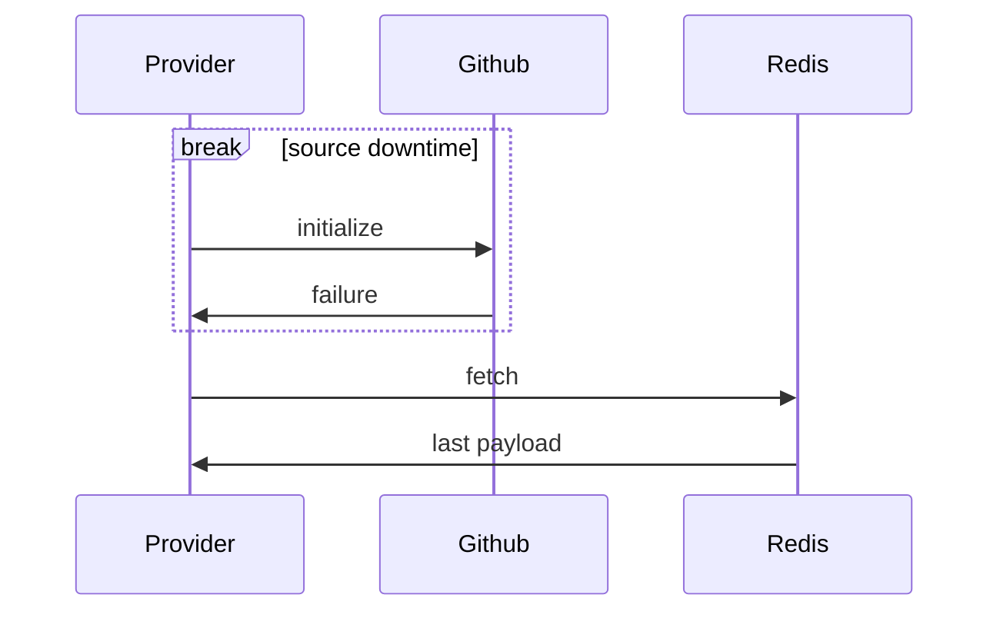

# Http Connector

## Introduction
Http Connector is a tool for [flagd](https://github.com/open-feature/flagd) in-process resolver.

This mode performs flag evaluations locally (in-process). 
Flag configurations for evaluation are obtained via gRPC protocol using 
[sync protobuf schema](https://buf.build/open-feature/flagd/file/main:sync/v1/sync_service.proto) service definition.

## Http Connector functionality

HttpConnector is responsible for polling data from a specified URL at regular intervals.  
It is leveraging Http cache mechanism with 'ETag' header, then when receiving 304 Not Modified response,
reducing traffic, reducing rate limits effects and changes updates. Can be enabled via useHttpCache option.  
The implementation is using Java HttpClient.

## Use cases and benefits
* Reduce infrastructure/devops work, without additional containers needed.
* Use as an additional provider for fallback / internal backup service via multi-provider.

### What happens if the Http source is down when application is starting ?

It supports optional fail-safe initialization via cache, such that on initial fetch error following by
source downtime window, initial payload  is taken from cache to avoid starting with default values until
the source is back up. Therefore, the cache ttl expected to be higher than the expected source
down-time to recover from during initialization.

### Sample flow
Sample flow can use:
- Github as the flags payload source.
- Redis cache as a fail-safe initialization cache.

Sample flow of initialization during Github down-time window, showing that application can still use flags
values as fetched from cache.


## Usage

### Installation
<!-- x-release-please-start-version -->
```xml
<dependency>
  <groupId>dev.openfeature.contrib.tools</groupId>
  <artifactId>flagd-http-connector</artifactId>
  <version>0.0.1</version>
</dependency>
```
<!-- x-release-please-end-version -->

### Usage example

```java

HttpConnectorOptions httpConnectorOptions = HttpConnectorOptions.builder()
    .url("http://example.com/flags")
    .build();
HttpConnector connector = HttpConnector.builder()
    .httpConnectorOptions(httpConnectorOptions)
    .build();

FlagdOptions options =
    FlagdOptions.builder()
        .resolverType(Config.Resolver.IN_PROCESS)
        .customConnector(connector)
        .build();

FlagdProvider flagdProvider = new FlagdProvider(options);
```
